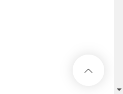

This preact component will create srollToTop button on the bottom-right of your page



How to use
===========

```
import {h, render, } from "preact";

import ScrollTop from "./ScrollTop";
import "./scrollTop.scss";

render(<ScrollTop />, document.getElementById('scrollTop'));
```